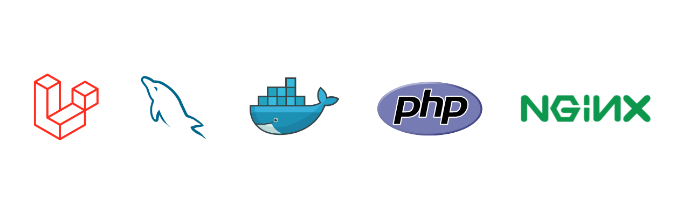

<p align="center">
    
</p>

## Laravel

Target is to run laravel as Docker container with other services such as nginx, mysql, redis, aws\* etc. Should be able to manage the services with docker-compose.

## To start this repo for the first time

```
$ make build-new
```

-   Once the build finishes, On a new terminal tab at the same dir run

```
$ make build-setup
```

### For every other regular starts

```
$ make
```

### > To run composer or artisan commands:

-   Start the project first. On a new terminal/tab run at the same dir, run:

```
$ make composer c=<your_command>
```

-   example:

```
$ make composer c=about
$ make php-artisan c=about
```

### > To run any common command on the laravel app
```
make exec command="any command"
```
- example
```
make exec command="php artisan --version"
```

### > To get to the application container shell

```
$ make container
```

-   To get to the container mysql shell

```
$ make db
```

-   You can add your custom commands, follow the makefile, then ./scripts files

#### To visit the site go to [http://127.0.0.1:8000]

[Iamreallynotabigfanofphpandlaravelin2020.justcurioustoknowmoreaboutthisframework]

## About Laravel

Laravel is a web application framework with expressive, elegant syntax. We believe development must be an enjoyable and creative experience to be truly fulfilling. Laravel takes the pain out of development by easing common tasks used in many web projects, such as:

-   [Simple, fast routing engine](https://laravel.com/docs/routing).
-   [Powerful dependency injection container](https://laravel.com/docs/container).
-   Multiple back-ends for [session](https://laravel.com/docs/session) and [cache](https://laravel.com/docs/cache) storage.
-   Expressive, intuitive [database ORM](https://laravel.com/docs/eloquent).
-   Database agnostic [schema migrations](https://laravel.com/docs/migrations).
-   [Robust background job processing](https://laravel.com/docs/queues).
-   [Real-time event broadcasting](https://laravel.com/docs/broadcasting).

Laravel is accessible, powerful, and provides tools required for large, robust applications.

## Learning Laravel

Laravel has the most extensive and thorough [documentation](https://laravel.com/docs) and video tutorial library of all modern web application frameworks, making it a breeze to get started with the framework.

If you don't feel like reading, [Laracasts](https://laracasts.com) can help. Laracasts contains over 1500 video tutorials on a range of topics including Laravel, modern PHP, unit testing, and JavaScript. Boost your skills by digging into our comprehensive video library.
